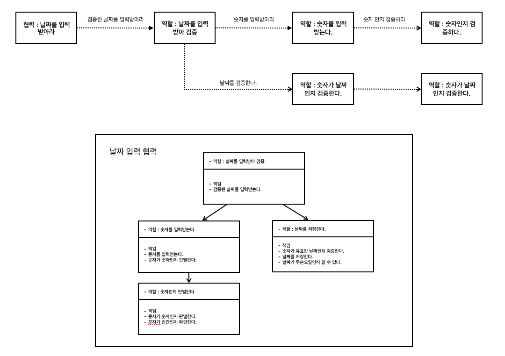
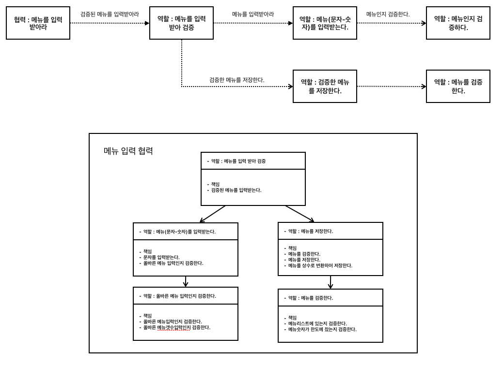
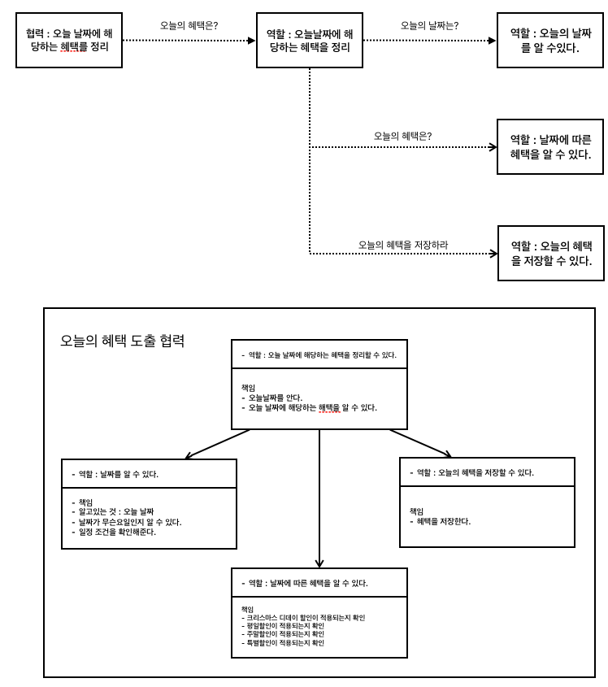
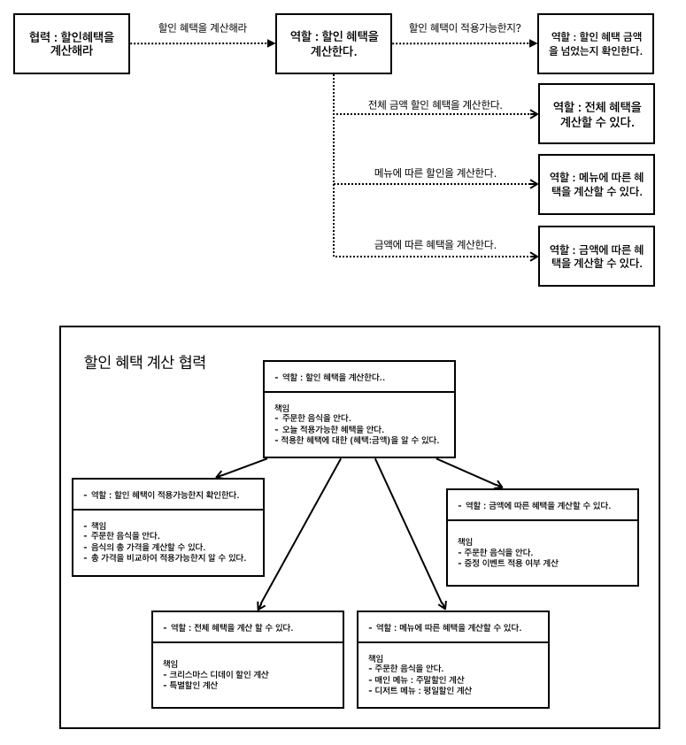

# 미션 - 크리스마스 프로모션

## 🧑‍💻 미션 설명

12월 우테코 식당에서 이벤트를 개최한다.
이벤트 동안 사용될 할인 헤택 계산기를 구현하는 문제.

### 할인 혜택

- 크리스마스 디데이 할인(2023.12.1 ~ 2023.12.25) : 1000원부터 하루에 100원씩 증가하여 할인
- 평일 할인(일요일~목요일) : 디저트 메뉴 1개당 2023원 할인
- 주말 할인(금요일, 토요일) : 메인 메뉴 1개당 2023원 할인
- 특별 할인 : 달력에 별이 있으면 1000원 할인
- 증정 이벤트 : 할인 전 금액이 120000원 이상 일때, 샴페인 증정

## 절차적 기능 명세

1. 식당 예상 방문 날짜 입력
2. 해당 날짜에 적용 가능한 할인 혜택을 정리한다.
3. 주문 메뉴,개수 입력
4. 주문메뉴와 오늘 할인혜택을 비교하여 할인 혜택을 도출한다.
5. 사용자에게 정보를 제공한다.

## 📝 기능 명세

- [X] 날짜를 입력 받는다.
    - [X] 입력 형식이 올바른지 확인한다.
        - [X] [ERROR] 빈값인지 확인한다.
        - [X] [ERROR] 숫자인지 확인한다.
    - [X] 올바른 날짜인지 확인한다.
        - [x] [ERROR] 1~31일 사이인지 확인한다.
- [X] 메뉴를 입력 받는다.
    - [X] 입력 형식이 올바른지 확인한다.
        - [X] [ERRPR] 빈값인지 확인한다.
        - [X] [ERROR] ,로 메뉴들을 구분했는지 확인한다.
        - [X] [ERROR] 메뉴-개수 형식을 지켰는지 확인한다.
            - [X] 메뉴-개수에서 -를 포함하고 있는지 확인한다.
            - [X] -메뉴, 메뉴--메뉴, 메뉴-로 잘못사용하였는지 확인한다.
            - [X] -로 구분했을 떄 2개로 나누어지는지 확인한다.
        - [X] [ERROR] 메뉴가 빈값인지 확인한다.
        - [X] [ERROR] 개수가 빈값인지 확인한다.
        - [X] [ERROR] 개수가 숫자가 아닌지 확인한다.
        - [X] [ERROR] 중복된 메뉴가 있는지 확인한다.
    - [X] 올바른 메뉴인지 확인한다.
        - [X] [ERROR] 존재하는 메뉴인지 확인한다.
        - [X] [ERROR] 메뉴개수가 20개를 넘어가는지 확인한다.
        - [X] [ERROR] 메뉴개수가 0인지 확인한다.
        - [X] [ERROR] 메뉴가 음료로만 이루어져 있는지 확인한다.

- [X] 오늘 날짜에 해당하는 혜택들을 정리한다.
    - [X] 오늘날짜가 이밴트 날짜에 해당하는지 확인한다.
        - [X] 오늘날짜에 크리스마스 디데이 할인이 포함되어 있는지 확인한다.
            - [ ] ~~1-25일 사이인지 확인한다.~~
        - [X] 오늘날짜에 평일할인이 포함되어 있는지 확인한다.
            - [ ] ~~일요일-목요일인지 확인한다.~~
        - [X] 오늘날짜에 주말할인이 포함되어 있는지 확인한다.
            - [ ] ~~금요일, 토요일인지 확인한다.~~
        - [X] 오늘날짜에 특별할인이 포함되어 있는지 확인한다.
            - [ ] ~~일요일 + 25일인지 확인한다.~~

- [X] 할인 혜택을 계산한다.
    - [X] 할인혜택을 적용 가능한지 확인한다.
        - [X] 총주문 금액 10,000원 이상인지 확인한다.
    - [X] 날짜에 따른 전체 할인혜택을 계산한다.
        - [X] 크리스마스 디데이 할인
        - [X] 특별할인
    - [X] 메뉴에 따른 할인을 계산한다.
        - [X] 디저트 메뉴 - 평일 할인
        - [X] 메인 메뉴 - 주말 할인
    - [X] 금액에 따른 혜택들을 정리한다.
        - [X] 증정 이벤트 대상인지 확인한다.(할인 전 총주문 금액이 12만 원 이상)

- [x] 이벤트 배지 대상인지 확인한다.
    - [X] 혜택 금액이 일정한 금액 이상인지 확인한다.

- [X] 계산 결과를 출력한다.
    - [X] 오늘 날짜와 웰컴멘트를 출력한다.
    - [X] 주문 메뉴들을 출력한다.
    - [X] 할인전 총금액을 출력한다.
    - [X] 증정메뉴를 출력한다.
    - [X] 혜택내역을 출력한다.
    - [X] 총혜택금액을 출력한다.
    - [X] 할인 후 예상 금액을 출력한다.
    - [X] 이벤트 배지를 출력한다.

## 개인적인 추가 목표

- 메뉴가 추가되도 enum을 통한 관리가 되었으면 좋겠음
- 할인 조건이 추가되더라도 enum을 통한 관리가 되었으면 좋겠음
- 객체분리의 근본목표는 유지보수임을 상기하며 설계

## 책임 주도 설계

협력 ➡️ 행동 ➡️ 상태 순으로 설계하며

협력을 바탕으로 책임을 설정, 다시 책임을 더 작은 책임으로 만들어가며 객체를 선택하여 설계를 시도

### 날짜를 입력받는다.

### 매뉴를 입력받는다.

### 오늘 날짜에 해당하는 혜택을 정리한다.

### 할인 헤택을 계산한다.

